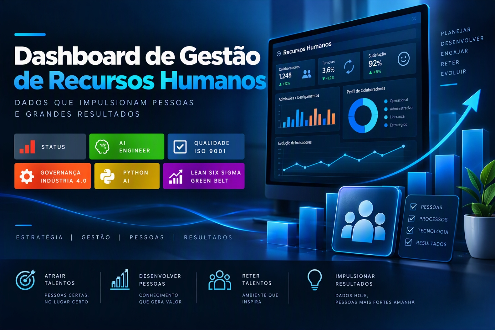

  

  
  
  
  
  

# Dashboard de Gestão de Recursos Humanos

> **AI Engineer | Especialista em Governança 4.0 e Qualidade | Engenheiro Químico**  
> [Mauá, SP](mailto:ornelas.tozato@gmail.com) | [LinkedIn](https://www.linkedin.com/in/rafaeltozato81) | [GitHub](https://github.com/Rafael-TOZATO) | [Portfólio PWA](https://tozato-dev-hub.vercel.app) | [Medium](https://medium.com/@ornelas.tozato)

## Objetivo do Projeto
Estruturar e desenvolver um dashboard analítico para o setor de Recursos Humanos, focado na consolidação de métricas corporativas, acompanhamento de indicadores de desempenho e inteligência de pessoas.

---

## Perguntas de Negócio Respondidas pelo Relatório
* **Qual é o volume total de colaboradores (Headcount) e sua distribuição por departamento?**
  * Análise do quantitativo de funcionários ativos segmentados por setor e cargo.
* **Qual é a taxa de rotatividade (Turnover) da organização?**
  * Mapeamento do percentual de admissões e desligamentos ao longo do período analisado.
* **Qual é o custo total com pessoal e a média salarial por área?**
  * Consolidação financeira das remunerações corporativas para identificação de distribuição orçamentária.
* **Como se comporta a distribuição demográfica e o tempo de casa (Tenure)?**
  * Mapeamento do tempo de permanência dos colaboradores e perfil dos setores.

---

## Ferramentas e Tecnologias
* Microsoft Power BI Desktop
* Modelagem de Dados
* Linguagem DAX (Data Analysis Expressions)

---

## Resolução de Problemas e Troubleshooting
Durante a fase de implantação e entrega, o projeto exigiu a aplicação de métodos de troubleshooting para solucionar impeditivos técnicos relacionados a restrições de dados e performance.

---

## Como Visualizar o Projeto
1. Realize o download do arquivo com extensão `.pbix` hospedado neste repositório.
2. Abra o arquivo utilizando a aplicação Microsoft Power BI Desktop.
3. Navegue entre as páginas do relatório para interagir com as métricas e painéis desenvolvidos.

---

## Autor

**Rafael Ornelas Tozato**

Engenharia Química | Garantia da Qualidade | Governança 4.0

### Contato

- LinkedIn: [linkedin.com/in/rafaeltozato81](https://www.linkedin.com/in/rafaeltozato81)
- GitHub: [github.com/Rafael-TOZATO](https://github.com/Rafael-TOZATO)
- Medium: [medium.com/@ornelas.tozato](https://medium.com/@ornelas.tozato)
- Portfólio PWA: [tozato-dev-hub.vercel.app](https://tozato-dev-hub.vercel.app)
- DIO: [web.dio.me/users/ornelas_tozato](https://web.dio.me/users/ornelas_tozato)
